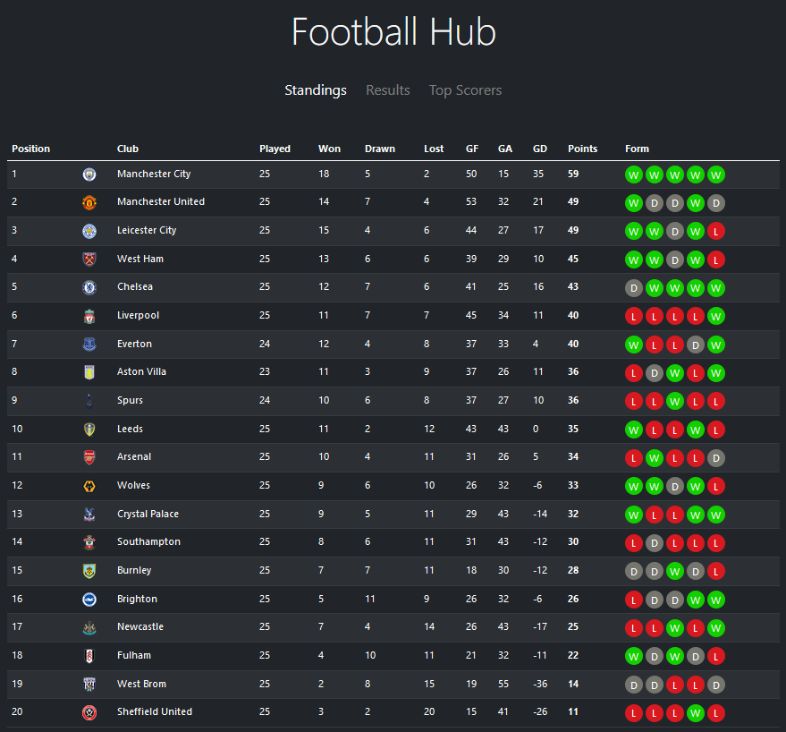

# Football Hub

A  Node.js app for displaying the latest results and standings in the English Premier League.

The app's data is gathered used the API provided by [football-data.org](https://www.football-data.org/).

## Technologies
- Node.js
- Lanuages: HTML, JavaScript
- Frameworks: Bootstrap, Handlebars

## Usage

You will need to sign up for football-data.org to get an Authorization Token. They provide a free plan.

```
# Clone the repository:
$ git clone https://github.com/TonyN96/football-hub.git

# Go into the repository:
cd football-hub

# Install dependencies:
$ npm install
```

In `.env_sample` replace `YOUR_X_AUTH_TOKEN_HERE` with your Authorization Token from football-api.org.
Rename  `.env_sample` file to `.env`

```
# Run the app:
$ npm start
```

